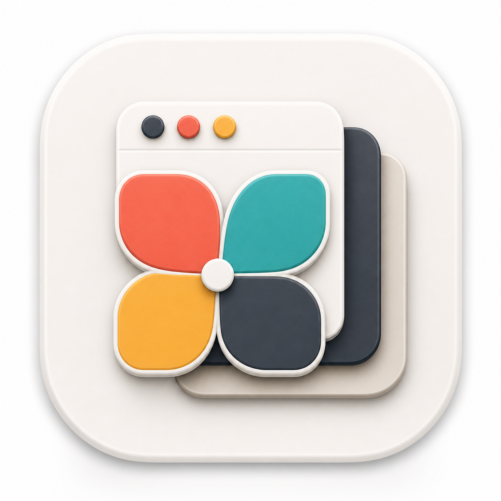
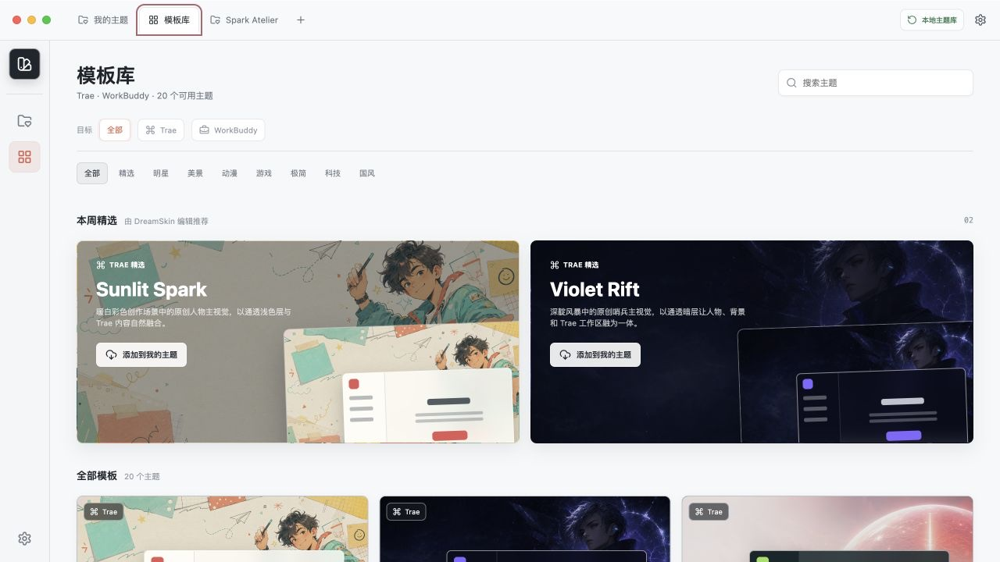
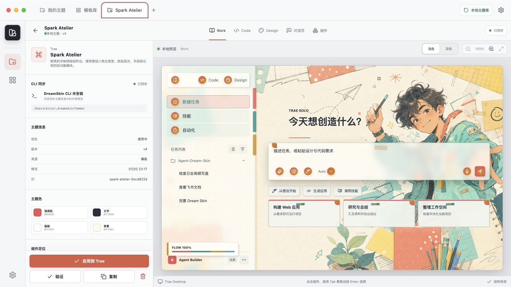
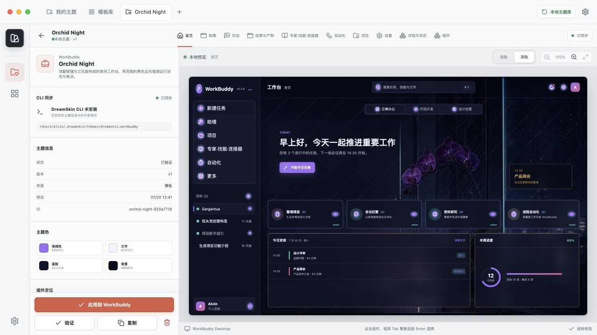

<p align="center">
  
</p>

<h1 align="center">DreamSkin Studio</h1>

<p align="center"><strong>让本地 Agent 的工作空间，真正长成你喜欢的样子。</strong></p>

<p align="center">
  像管理 Obsidian 笔记库一样管理你的桌面 Agent 主题。<br>
  Studio 负责收藏、预览与应用，<code>dreamskin</code> CLI 让你正在使用的编程 Agent 直接参与创作。
</p>

<p align="center">
  
  
  
  
</p>

<p align="center">
  <a href="https://github.com/l77948032-cyber/Agent-Dream-Skin/releases/download/test-v0.4.0-macos-arm64/DreamSkin-Studio-0.4.0-mac-arm64.dmg"><strong>下载 macOS 测试版 DMG</strong></a>
  ·
  <a href="https://github.com/l77948032-cyber/Agent-Dream-Skin/releases/tag/test-v0.4.0-macos-arm64">查看发行说明</a>
</p>



## 它是什么

DreamSkin Studio 是一座放在本机的主题库。你可以浏览模板、添加到“我的主题”、从空白
开始创作，并在应用前检查目标软件的首页、对话页和组件状态。主题文件、预览与修改记录
都留在自己的电脑上。

Studio 不内置 Agent，也不会要求你在应用里再连接一个 Agent。你可以继续使用熟悉的 Codex、
Claude Code 或其他编程 Agent，让它们按需调用 `dreamskin` CLI 读写同一座本地主题库。
Studio 会自动发现这些修改并刷新预览。

| Studio | `dreamskin` CLI | 最终控制权 |
| --- | --- | --- |
| 浏览 20 套模板，管理“我的主题”，查看完整界面效果。 | 让编程 Agent 查询目标、读取主题、创建、修改和验证主题。 | 应用与恢复仍由你在 Studio 中明确触发，Agent 不会擅自改变正在运行的软件。 |

## 不只是换一张背景

DreamSkin 改变的是一整套界面语言。背景、色彩、材质、导航、对话、输入区、按钮、卡片、
通知和浮层会作为同一个主题一起变化，而不是在原界面后面简单垫一张壁纸。

<table>
  <tr>
    <td width="50%"></td>
    <td width="50%"></td>
  </tr>
  <tr>
    <td valign="top">
      <strong>Trae：让编码空间拥有完整视觉个性</strong><br><br>
      在同一主题里查看 Work、Code、Design、对话页和常用组件，确认导航、内容、输入区与
      状态反馈属于同一套设计语言。
    </td>
    <td valign="top">
      <strong>WorkBuddy：把日常工作台变成自己的空间</strong><br><br>
      集中检查首页、对话、结果与产物、专家与技能、自动化、项目、设置、浮层与状态，
      避免大块面板盖住背景和主题细节。
    </td>
  </tr>
</table>

## 20 套内置主题

主题中心内置 20 套可直接添加的模板，覆盖 Trae 与 WorkBuddy，并包含明亮、深色、自然、
城市、纸艺、科技和沉浸场景等不同视觉方向。每套模板都包含目标应用的重要页面、组件状态
和配套背景，不只是一个颜色预设。

模板原版始终保留。添加到“我的主题”后，你得到的是一份可以独立修改、复制和继续创作的
本地副本。也可以直接新建空白主题，让 Agent 从一句描述开始生成。

## 从灵感到应用

1. 在主题中心按目标应用与风格浏览模板。
2. 点击“添加到我的主题”，或者为指定应用新建空白主题。
3. 在 Studio 设置中安装 `dreamskin` CLI。
4. 回到你平时使用的编程 Agent，让它通过 CLI 修改指定主题。
5. Studio 自动刷新右侧预览；逐项检查页面、按钮、输入框、通知与浮层。
6. 确认无误后，在 Studio 中明确执行应用；需要时同样由你执行恢复。

你可以直接这样告诉 Agent：

> 使用 dreamskin CLI，先列出 Trae 的“我的主题”，再把我指定的那一套改成清爽的冬日视觉。
> 保留高可读性，主要操作使用冷绿色，警告状态仍要醒目。修改后完成验证，但不要应用主题。

也可以基于已有模板继续收敛：

> 读取我指定的 WorkBuddy 主题，把背景细节保留下来，降低面板遮挡感，提高正文和输入区
> 对比度。更新时使用读取结果里的 revision，并在完成后验证。

## 给编程 Agent 的本地 CLI

安装后，任何能执行本机命令的编程 Agent 都可以使用同一个稳定入口：

```bash
dreamskin targets
dreamskin theme inspect --plugin dreamskin.trae
dreamskin theme list --plugin dreamskin.trae
dreamskin theme read <theme-id> --plugin dreamskin.trae
dreamskin theme create <theme-id> --plugin dreamskin.trae --input @theme.json
dreamskin theme update <theme-id> --plugin dreamskin.trae \
  --expected-revision <revision> --input @patch.json
dreamskin theme asset import <theme-id> --plugin dreamskin.trae \
  --expected-revision <revision> --file /absolute/path/background.png
dreamskin theme validate <theme-id> --plugin dreamskin.trae
```

CLI 输出结构化 JSON，便于 Agent 判断成功、错误和 revision 冲突。每条主题命令都必须明确
目标应用；修改时也必须带上刚读取到的 revision，避免覆盖其他进程刚完成的编辑。

CLI 只负责主题检查、读取、创建、结构化更新、受校验的背景导入与验证。背景导入仅接受
PNG/JPEG/WebP 普通文件，会复制到主题库并拒绝符号链接或超大文件。CLI 不提供应用、恢复、
删除或任意 CSS 执行能力。详细契约见 [DreamSkin Agent Tool v1](./docs/agent-tool-v1.md)。

## 下载与安装

DreamSkin Studio 已按 macOS 桌面应用交付，不需要另开网页或常驻开发服务器。当前 Apple
silicon 测试版可以从 [GitHub Releases](https://github.com/l77948032-cyber/Agent-Dream-Skin/releases/tag/test-v0.4.0-macos-arm64)
公开下载：

1. 下载 [`DreamSkin-Studio-0.4.0-mac-arm64.dmg`](https://github.com/l77948032-cyber/Agent-Dream-Skin/releases/download/test-v0.4.0-macos-arm64/DreamSkin-Studio-0.4.0-mac-arm64.dmg)
   和同一 Release 中的 [`SHA256SUMS.txt`](https://github.com/l77948032-cyber/Agent-Dream-Skin/releases/download/test-v0.4.0-macos-arm64/SHA256SUMS.txt)。
2. 在终端运行 `shasum -a 256 ~/Downloads/DreamSkin-Studio-0.4.0-mac-arm64.dmg`，确认结果与
   `SHA256SUMS.txt` 中 DMG 对应的一行完全相同。
3. 打开 DMG，把 **DreamSkin Studio** 拖到右侧的 **Applications**。
4. 从“应用程序”启动，浏览模板或管理自己的主题。
5. 需要 Agent 参与创作时，在 Studio 设置中安装 `dreamskin` CLI。

安装 DreamSkin Studio 本身不要求本机安装 Node.js。DMG 是推荐安装方式，ZIP 只作为备用
分发格式。

> 当前公开包是经过安装验收的 **ad-hoc 签名测试版**。其他用户可以下载，但 macOS 可能
> 显示开发者验证提示。面向所有用户的免警告正式版仍需 Developer ID 签名和 Apple 公证。

首次打开时，如果 macOS 提示无法验证开发者，请先确认 SHA-256 匹配，再到“应用程序”中
按住 Control 点击（或右键点击）**DreamSkin Studio**，选择“打开”，并在确认框中再次选择
“打开”。如果仍被阻止，可前往“系统设置 -> 隐私与安全性”，在安全性提示旁选择“仍要打开”。
校验不匹配时不要绕过系统保护，请删除文件并从本项目 Release 重新下载。

本版功能、兼容性、升级与已知限制见 [v0.4.0 发行说明](./docs/releases/v0.4.0.md)。

## 从源码运行

DreamSkin Studio 是本地桌面应用，目前不提供云端演示。开发与本地打包推荐环境：

- macOS 12 或更高版本，Apple silicon。
- Node.js `>= 22.12`。
- 已安装 Trae 或 WorkBuddy。

```bash
git clone https://github.com/l77948032-cyber/Agent-Dream-Skin.git
cd Agent-Dream-Skin
npm install
npm --prefix studio install
npm run desktop:dev
```

生成本机测试安装包：

```bash
npm run desktop:installer:mac
```

产物位于 `dist-desktop/`。未配置 Apple Developer ID 时使用 ad-hoc 签名，适合本机、受控
测试，或按发布清单明确标注为“未签名测试版”的公开 prerelease；它不能进入 stable/latest
更新通道。免警告稳定版仍需要 Developer ID 签名与 Apple 公证。

## 当前支持

| 应用 | 当前体验 |
| --- | --- |
| **Trae** | macOS 实机适配，覆盖 Work、Code、Design、对话页与 20 个语义组件；当前重点验证版本为 TRAE SOLO CN `0.1.36`。 |
| **WorkBuddy** | macOS WorkBuddy `5.2.6` 实机适配，覆盖 9 个完整场景与 32 个语义组件。 |
| **Windows** | 相关运行与打包仍在验证阶段，暂不建议作为稳定体验环境。 |

### 使用前请知道

- 当前项目属于开发者预览，优先推荐在 macOS Apple silicon 上体验。
- 目标应用升级后，界面变化可能需要 DreamSkin 更新适配。
- 关闭 Studio 不等于恢复原生主题；需要清理时，请在 Studio 中使用“恢复原生界面”。
- 编程 Agent 只能编辑和验证主题，不能通过 CLI 应用或恢复主题。
- 本机构建不包含公开发行所需的 Apple Developer ID 签名与公证。

## 常见问题

<details>
<summary><strong>需要在 Studio 里连接 Agent 吗？</strong></summary>
<br>
不需要。Studio 不内置对话，也不连接 Agent。继续使用你熟悉的编程 Agent，让它直接调用
本机的 <code>dreamskin</code> CLI 即可。
</details>

<details>
<summary><strong>需要常驻运行一个主题服务吗？</strong></summary>
<br>
不需要。Studio 管理本地主题库，CLI 只在 Agent 执行命令时运行。
</details>

<details>
<summary><strong>添加模板会覆盖原版吗？</strong></summary>
<br>
不会。模板会作为独立副本加入“我的主题”，之后的修改只属于这份副本。
</details>

<details>
<summary><strong>可以完全从零开始吗？</strong></summary>
<br>
可以。选择目标应用后新建空白主题，再让编程 Agent 通过 CLI 逐步生成和调整。
</details>

<details>
<summary><strong>关闭 Studio 后主题还在吗？</strong></summary>
<br>
已经应用的主题不会因为 Studio 窗口关闭而立刻消失。需要结束主题时，请主动使用“恢复原生
界面”；目标应用退出后，则可在下次使用时重新应用并验证。
</details>

## 接下来

- 适配更多桌面 Agent 应用。
- 支持社区主题的导入、分享与版本管理。
- 增加更多官方主题案例与创作工作流。
- 完成 Windows 实机验收。
- 增加静默更新与升级后数据保留验收。

## 反馈与贡献

不需要上传代码也可以参与。发现问题、想到新的主题方向，或者希望 DreamSkin 支持其他桌面
Agent 应用，都可以通过 [Issue](https://github.com/l77948032-cyber/Agent-Dream-Skin/issues)
告诉我们。反馈兼容性问题时，建议附上目标应用版本、系统版本、复现步骤和截图。

如果希望贡献代码或主题，可以先 Fork 本项目，在自己的仓库中完成修改，再提交 Pull Request。
Pull Request 不会直接改动本仓库，是否合并由项目维护者审核决定。

只想下载、运行和创作自己的主题，不需要提交 Issue 或 Pull Request。

## 许可与说明

- [素材与来源说明](./NOTICE.md)
- [第三方许可](./THIRD_PARTY_NOTICES.md)

本项目采用 [MIT License](./LICENSE)。外部注入思路参考了
[Fei-Away/Codex-Dream-Skin](https://github.com/Fei-Away/Codex-Dream-Skin)。

Agent Dream Skin 是非官方社区项目，不代表 Trae、WorkBuddy、ByteDance、OpenAI 或相关
产品方。
