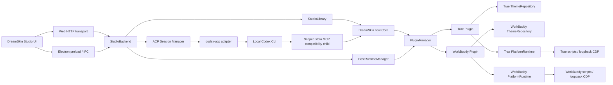
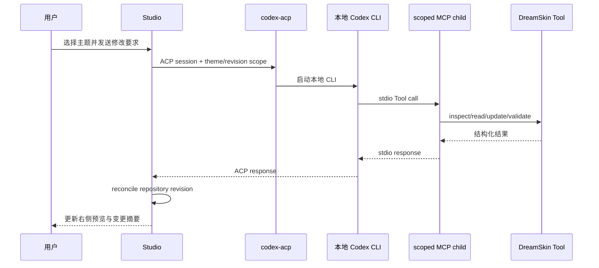
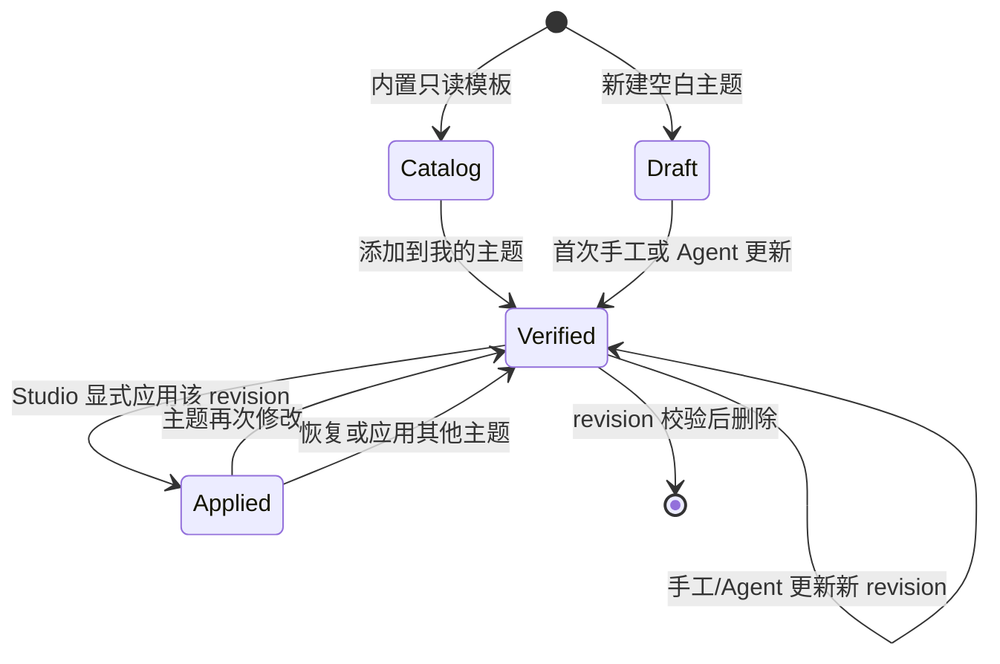

# Agent Dream Skin 架构

本文描述 `0.2.0` 的可交付架构。它区分稳定产品边界、Trae 与 WorkBuddy 两个第一方
target plugin、隐藏兼容层和尚未交付的扩展能力。

## 1. 设计原则

1. **主题是结构化数据，不是任意 CSS。** Agent 只能修改 schema 允许的颜色、状态、
   外观、布局和视觉 recipe。
2. **Tool 是稳定边界。** Studio、CLI、ACP host 和兼容 adapter 复用同一套 Tool Core，
   不分别实现主题逻辑。
3. **目标差异由 Plugin 拥有。** 组件 registry、模板 catalog、runtime mapping、基础 CSS
   和目标应用操作都属于插件。
4. **Agent 编辑与应用 runtime 分权。** Agent 可读写并验证主题；应用、截图、恢复和
   rollback 只能由 Studio 或调试 CLI 显式触发。
5. **只读程序与可写用户数据分离。** 打包资源按 manifest 校验，用户主题、状态、备份
   和版本化 runtime 位于 Electron userData。

## 2. 总体分层



### 2.1 模块职责

| 层 | 主要代码 | 职责 |
| --- | --- | --- |
| Studio UI | `studio/src/` | 主题中心、我的主题、对话编辑器、效果展示与显式 runtime 操作 |
| Studio backend | `src/core/studio-backend.mjs` | 组织 library、Agent session、Tool 和 host runtime |
| Studio library | `src/core/studio-library.mjs` | catalog 与用户主题的 DTO、library manifest、revision 状态与同步 |
| Tool Core | `src/core/dreamskin-tool.mjs` | 单一 `dreamskin_theme` 合约和严格参数验证 |
| Plugin host | `src/core/plugin-manager.mjs` | 插件注册、资源解析、激活、action dispatch 与能力边界 |
| Trae Plugin | `plugins/trae/` | 六套 Trae 模板、schema、20 个语义组件、runtime mapping 和 runtime adapter |
| WorkBuddy Plugin | `plugins/workbuddy/` | 三套 WorkBuddy 模板、schema、32 个语义组件、9 个场景、runtime mapping 和 runtime adapter |
| Repository | `src/core/theme-repository.mjs` | 主题读写、校验、锁、原子提交、备份、删除和 rollback |
| ACP | `src/core/acp-session-manager.mjs` | 本地 CLI Agent 生命周期、session、权限策略和响应聚合 |
| Platform runtime | `src/core/platform.mjs`, `src/core/workbuddy-platform.mjs`, `scripts/`, `assets/` | 启动、验证、停止各目标受 DreamSkin 管理的 CDP 会话 |
| Desktop shell | `desktop/` | Electron 窗口、custom protocol、IPC、路径、资源安装和退出清理 |

## 3. Tool 与 Plugin 边界

### 3.1 Agent Tool

Agent host 只注册一个名为 `dreamskin_theme` 的 Tool。公开 action 为：

| Action | 含义 |
| --- | --- |
| `inspect` | 获取公开 schema、语义组件、runtime mapping 摘要和仓库主题摘要 |
| `list` | 列出当前插件管理的主题 |
| `read` | 读取一个结构化主题及 revision |
| `create` | 从插件允许的 catalog source 创建主题 |
| `update` | 使用 `expectedRevision` 和 `themePatch` 更新主题 |
| `validate` | 校验已有主题或结构化输入 |

Agent Tool 不包含 `apply`、`preview`、`verify`、`restore`、删除和 rollback。Tool 输入不接受
任意文件路径、任意 CSS 或 shell 命令。

### 3.2 Plugin contract

插件清单声明：

- plugin id、版本和目标应用；
- theme schema、组件 registry 和 runtime mapping 的相对路径；
- Tool action 与 host runtime capability；
- 可选 catalog 根和 executable entry。

内置 Trae 与 WorkBuddy 工厂代码随 `app.asar` 分发，数据资源从可注入的 plugin root
解析。开发环境默认使用仓库中的 `plugins/trae` 和 `plugins/workbuddy`；正式包使用
`Contents/Resources/dreamskin/plugins/<target>`。绝对资源路径不会进入 Agent 可见的
plugin descriptor 或 inspect 结果。

`createDreamSkinApplicationContext` 同时注册并激活第一方 `dreamskin.trae` 和
`dreamskin.workbuddy`，同时保留单目标 context 给 CLI 与兼容入口。每个 target 持有自己的
repository、catalog、service、platform runtime、theme root、data root 和 backup root；
调用必须携带或继承对应 `pluginId`，不能把一个 target 的主题或 revision 用在另一个 target。
第三方 executable plugin 的 UI 安装、签名信任和进程隔离尚未作为正式功能开放。

## 4. Studio transport

### 4.1 Web 开发模式

Vite UI 运行在 `127.0.0.1:5173`，本地 Studio server 运行在
`127.0.0.1:4242`。服务端拒绝非 loopback Host、跨 origin mutation 和非 JSON 写入。

### 4.2 Electron 模式

正式窗口加载 `dreamskin://studio/`，不启动可被其他程序访问的 HTTP server。前端检测
`window.dreamskin.studio` 后使用 preload 暴露的窄接口；IPC router 只接受列入 allowlist
的 operation，并验证 sender 属于当前 Studio 窗口。

BrowserWindow 安全设置包括：

- `sandbox: true`；
- `contextIsolation: true`；
- `nodeIntegration: false`；
- 拒绝新窗口、webview、非 DreamSkin navigation 和所有默认权限；
- custom protocol 使用严格 CSP、same-origin mutation 和固定 MIME；
- 单实例运行，退出时等待 Agent、IPC 和 protocol 请求完成或进入有界超时清理。

## 5. ACP 与隐藏 MCP 兼容层

ACP 是 Studio 连接本地 CLI Agent 的会话协议。正式桌面资源只携带自包含的
`acp/codex-acp.mjs`，不携带 `@openai/codex` 的平台二进制；Codex 必须来自用户本机。
发现顺序包括显式 `DREAMSKIN_CODEX_PATH` / `CODEX_PATH`、官方应用内 CLI 和常见 PATH。

对话链路如下：



这里的 MCP 是由 Studio 创建的短生命周期 **stdio 子进程**，不监听端口，也不要求用户
安装、配置或启动 MCP server。每个 session 被锁定到一个 plugin id、theme id 和预期
revision；Studio 同时注入该 plugin 专属的 plugin root、theme root、data root 和 backup
root。权限策略只允许当前范围内的 inspect/read/update/validate，因此 Trae 与 WorkBuddy
的锁、备份和恢复数据不会共享。旧九工具 profile 只供外部遗留集成使用。

当前桌面包只承诺 Codex ACP 链路。Claude Code、Gemini CLI 和 OpenCode 的定义是后续
connector 扩展点；没有随包提供相应 adapter，也没有完成正式端到端验收。

## 6. 主题模型与生命周期

每个主题目录至少包含：

```text
theme-id/
  theme.json
  background.png | background.jpg | background.webp
```

旧主题可以带 `skin.css`，但 Tool v1 只保留它，不允许 Agent 修改。

### 6.1 实例身份与视觉配方

`theme.id` 是 repository 和“我的主题”使用的实例身份。内置模板被添加或本地主题被复制时，
新实例会获得新的本地 id；CSS 不以这个 id 作为视觉选择器。`appearance.treatment` 才是由
插件 schema 约束、由 runtime 与 Studio 共同消费的稳定视觉配方身份。Trae injector 将它
写入 `data-trae-skin-treatment`，基础 CSS 按该属性组织组件、页面 chrome 和装饰细节。
因此 catalog template id、本地 theme id 与 CSS recipe 可以独立演进，复制进“我的主题”
后仍保留完整视觉语言。

`appearance.backgroundOverlay` 与 `backgroundBlendMode` 在 Trae 中分别映射到
`--trae-skin-overlay` 和 `--trae-skin-art-blend`，在 WorkBuddy 中映射到
`--dreamskin-overlay` 和 `--dreamskin-art-blend`。Studio showcase 读取所选 plugin 的同一
runtime mapping，避免预览和目标应用对字段的解释分叉。新建空白主题使用 `neutral`
treatment，只提供可编辑的中性结构，不继承任一 catalog 模板的专属装饰。

### 6.2 生命周期



- 同一内置模板重复添加是幂等的；删除后可再次添加为新的本地 id。
- 空白主题由插件提供安全基础结构，并以 `neutral` 视觉 recipe 开始。
- 更新、删除和 Agent 对话都要求 `expectedRevision`。
- commit 先在同级 staging 目录写入并完整加载验证，再通过 rename 替换。
- 已存在主题会先备份到插件的 managed backups；rollback 会复验备份 revision。
- “已应用”绑定到精确 revision，而不是仅绑定 theme id。
- 正在运行的主题不能直接删除。
- Studio 会 reconcile 外部 Tool/CLI 更新，并推进 library revision metadata。

### 6.3 Apply 与 Preview

Apply 数据流：

```text
Studio button
  -> validate selected theme
  -> HostRuntimeManager
  -> selected Plugin runtime action
  -> target PlatformRuntime fixed execFile command
  -> signed target discovery + owned PID/CDP identity checks
  -> injector applies registry-driven CSS and art
  -> verify runtime status
  -> record exact applied revision
```

Preview 会保存所选 target runtime 的 theme id 与精确 revision，在对应 repository lock 内
临时应用、验证并可截图，然后在 `finally` 中恢复之前的精确 revision 或目标应用原生界面。
如果 runtime 记录的 revision 已与仓库版本分叉，Preview 会在切换主题前 fail closed，要求
先重新应用或恢复；不会用同 id 的较新内容冒充原状态。Agent 不能绕过 Studio 直接调用这条
链路。

## 7. Runtime 安全模型

Trae 与 WorkBuddy runtime 都不修改或重签名安装包。平台脚本执行以下约束：

- CDP 只绑定 `127.0.0.1`；
- 校验目标 bundle id、签名发布者、可执行文件和目标 renderer；
- 记录并复验 PID、进程启动时间、CDP listener 和 browser identity；
- watcher 只管理 DreamSkin 自己启动并记录的会话；
- restore 只停止精确匹配的 owned process/job，关闭对应 listener，随后以普通模式重新启动
  目标应用；
- runtime 命令使用固定 executable 与参数数组，不拼接 shell command。

回环监听限制远程网络访问，但不是本机权限边界：端口开放期间，同机其他进程仍可尝试连接
CDP，而 CDP 可在 renderer 中执行 JavaScript。产品不能把 `127.0.0.1` 描述成认证机制；
安全性来自短生命周期、目标签名与进程身份校验、所有权记录以及可验证的 restore。

macOS injector 使用 Trae 自带 Node runtime：

```text
ELECTRON_RUN_AS_NODE=1 <Trae executable> scripts/injector.mjs ...
```

这是 Trae runtime 的执行方式，与 DreamSkin Studio Electron 主进程是两条不同链路。

WorkBuddy 在 macOS 使用目标应用支持的 `WORKBUDDY_REMOTE_DEBUGGING_PORT` 环境变量启动
CDP，并为 WorkBuddy 与持久 injector 分别创建 DreamSkin-owned 用户级 `launchd` job。
应用主题成功后，这两个 job 与 Studio 进程独立，所以退出 Studio 不会撤销当前皮肤。该设计
不承诺自动复活 WorkBuddy：如果用户退出 WorkBuddy，或 app/watcher/CDP 的任一身份检查
失败，`status` 必须返回 `degraded`。再次 apply 会先验证并清理旧的 owned 状态，再安全
重建会话；restore 会卸载两个 owned job、移除注入、关闭端口并以普通模式启动 WorkBuddy。

## 8. 桌面资源与 Electron fuses

`scripts/build-desktop-resources.mjs` 只复制白名单资源：

- Studio `dist`；
- Trae 与 WorkBuddy plugin 的 data-only manifest、catalog、assets 和 JSON resources；
- 两个 target 各自的最小 runtime 依赖；
- 单文件 `codex-acp` adapter；
- 产品与第三方许可文本。

构建器拒绝 symlink、路径穿越、未知 Studio 文件类型、版本漂移和超限内容，并使用 staging
目录生成稳定排序的 `resource-manifest.v1.json`。每个必需文件都有 SHA-256 和字节数。
正式包启动时把该清单作为 exact inventory：只允许清单本身、声明的文件及其必要父目录，
额外文件、symlink 和特殊节点都不被目录条目隐式授权。清单版本必须与
`app.getVersion()` 精确一致，否则启动 fail closed。

构建器分别生成 `runtime/dreamskin.trae/runtime-manifest.v1.json` 与
`runtime/dreamskin.workbuddy/runtime-manifest.v1.json`。首次启动正式包时，每个 target 的
`VersionedRuntimeInstaller` 独立验证并安装到 userData 的不可变版本目录，原子更新自己的
active/previous 状态并支持 runtime version rollback。任一已安装 runtime 的版本必须与
当前应用版本一致；缺失、漂移或校验失败不会降级继续运行。

`afterPack` 明确设置全部当前 Electron V1 fuses：

| Fuse | 值 | 原因 |
| --- | --- | --- |
| `RunAsNode` | 开 | 受控运行打包内 ACP 和 MCP Node 子进程 |
| `EnableCookieEncryption` | 开 | 加密 Electron cookie storage |
| `EnableNodeOptionsEnvironmentVariable` | 关 | 子进程不能通过 `NODE_OPTIONS` 注入参数 |
| `EnableNodeCliInspectArguments` | 关 | 禁止 CLI inspector 参数 |
| `EnableEmbeddedAsarIntegrityValidation` | 开 | 校验 `app.asar` integrity |
| `OnlyLoadAppFromAsar` | 开 | 主应用只从 ASAR 加载 |
| `LoadBrowserProcessSpecificV8Snapshot` | 关 | 不使用外部 browser snapshot |
| `GrantFileProtocolExtraPrivileges` | 关 | 不授予 file protocol 额外权限 |
| `WasmTrapHandlers` | 关 | 当前产品不需要该能力 |

`RunAsNode` 是已知且有意保留的能力。桌面只用固定 app entry、固定 adapter 路径、受控环境
和 `shell: false` 启动它；同时关闭 `NODE_OPTIONS` 与 inspector，减少扩大执行面的方式。

macOS `afterPack` 还会删除宽泛 ATS 和未使用的相机、麦克风、音频采集、蓝牙隐私声明。
fuse 修改发生在最终 Developer ID 签名之前。

## 9. 路径布局

### 9.1 开发 Web 与 CLI

| 数据 | 默认路径 |
| --- | --- |
| 内置插件 | `<repo>/plugins/trae`、`<repo>/plugins/workbuddy` |
| Trae Web 用户主题 | `~/.dreamskin/themes/` |
| WorkBuddy Web 用户主题 | `~/.dreamskin/themes/dreamskin.workbuddy/` |
| Trae Studio library / 数据 | `~/.dreamskin/library.json`、`~/.dreamskin/data/` |
| WorkBuddy Studio library / 数据 | `~/.dreamskin/libraries/dreamskin.workbuddy.json`、`~/.dreamskin/data/dreamskin.workbuddy/` |
| JSON CLI / Tool 默认主题 | `<repo>/themes` |
| JSON CLI / Tool 事务数据 | `<repo>/.trae-dream-skin` |
| Trae 注入状态（macOS） | `~/Library/Application Support/TraeDreamSkin` |
| WorkBuddy 脚本注入状态（macOS） | `~/Library/Application Support/WorkBuddyDreamSkin` |

可通过 `DREAMSKIN_STUDIO_HOME`、`DREAMSKIN_STUDIO_THEMES_ROOT`、
`TRAE_DREAM_SKIN_TOOL_HOME` 和 `TRAE_DREAM_SKIN_THEMES_ROOT` 覆盖 Studio / Tool 路径。
直接运行 WorkBuddy 平台脚本时，`WORKBUDDY_DREAM_SKIN_THEMES_ROOT` 和
`WORKBUDDY_DREAM_SKIN_HOME` 分别覆盖脚本主题根与 managed session 状态根。

### 9.2 正式桌面包

只读：

```text
DreamSkin Studio.app/Contents/Resources/dreamskin/
  resource-manifest.v1.json
  studio/dist/
  plugins/trae/
  plugins/workbuddy/
  acp/codex-acp.mjs
  runtime/dreamskin.trae/
  runtime/dreamskin.workbuddy/
  legal/
```

可写根由 `app.getPath("userData")/dreamskin` 决定。macOS 通常为：

```text
~/Library/Application Support/DreamSkin Studio/dreamskin/
  themes/dreamskin.trae/
  themes/dreamskin.workbuddy/
  previews/
  state/dreamskin.trae/library.json
  state/dreamskin.trae/catalog/
  state/dreamskin.trae/catalog-backups/
  state/dreamskin.workbuddy/library.json
  state/dreamskin.workbuddy/catalog/
  state/dreamskin.workbuddy/catalog-backups/
  state/dreamskin.workbuddy/runtime/
  backups/dreamskin.trae/
  backups/dreamskin.workbuddy/
  runtime/dreamskin.trae/versions/<version>/
  runtime/dreamskin.trae/active-runtime.v1.json
  runtime/dreamskin.workbuddy/versions/<version>/
  runtime/dreamskin.workbuddy/active-runtime.v1.json
  plugins/dreamskin.trae/
  plugins/dreamskin.workbuddy/
  logs/
```

Windows 使用 Electron 返回的 userData 根，不应在文档或代码中硬编码盘符。

## 10. 当前支持边界

已验证或随包交付：

- Trae 与 WorkBuddy 两个第一方 target plugin；
- macOS arm64 Electron `.app` 构建；
- 本地 Codex CLI 的 ACP 对话修改链路；
- Trae `0.1.36` 基线上的 macOS CDP runtime；
- WorkBuddy `5.2.6` 基线上的 macOS CDP runtime、三套模板、32 个组件和 9 个 Studio 场景；
- Web Studio 与 Electron Studio 的同一后端行为；
- 资源、runtime、repository、IPC、protocol 和安全策略自动化测试。

不应宣称已完成：

- Windows Electron/NSIS 安装包的真实机器验收；
- macOS x64 或 universal artifact 验收；
- 没有 Developer ID/公证凭据时的正式 macOS 分发；
- 除 Codex 外的打包 ACP connector；
- 第三方 plugin marketplace、签名信任与沙箱执行；
- 云同步、账户系统、自动更新和远程模板市场；
- 任意 CSS 或任意目标应用注入。

发布边界和凭据要求见 [release-checklist.md](release-checklist.md)。
