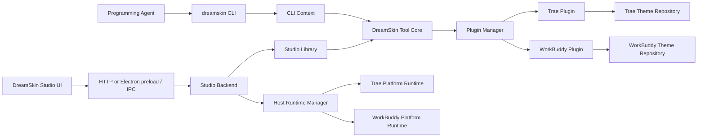

# DreamSkin Studio 架构

本文描述当前产品边界：DreamSkin Studio 是本地主题管理与运行时控制界面，编程 Agent
通过安装在本机的 `dreamskin` CLI 读写结构化主题。两者共享同一套插件、Tool Core、
repository 和用户数据，但职责与权限不同。

## 1. 设计原则

1. **主题是结构化数据。** 颜色、状态、布局、外观和视觉 recipe 必须通过 schema；不接受任意 CSS、DOM selector 或脚本。
2. **CLI 是 Agent 的唯一公开入口。** Agent 可 inspect、list、read、create、update 和 validate，不连接 Studio，也不拥有运行时操作。
3. **Studio 拥有用户可见的运行时变更。** preview、apply、verify、restore、删除和版本回退只能由 Studio 中的显式用户动作触发。
4. **目标差异由插件拥有。** Trae 与 WorkBuddy 各自提供 schema、组件 registry、catalog、runtime mapping 和平台适配器。
5. **桌面与 CLI 共享本地事实来源。** 两者解析到相同的用户主题、状态和备份根；revision 与 repository lock 防止覆盖并发修改。
6. **只读程序资源与可写用户数据分离。** 正式包资源通过 manifest 校验，所有可变数据位于 Electron userData 或目标运行时状态根。

## 2. 总体分层



CLI 与 Studio 不通过网络互相调用。它们分别建立应用上下文，并把同一 target 的请求交给
同一个本地目录中的 repository。Studio 在 list、read、reconcile 等操作中同步 manifest，
因此可发现 CLI 已提交的 revision。

## 3. 模块职责

| 层 | 主要代码 | 职责 |
| --- | --- | --- |
| JSON CLI | `bin/dreamskin.mjs`, `src/cli.mjs` | 严格解析命令和输入，输出 JSON v1 envelope，设置退出码 |
| CLI context | `src/core/cli-context.mjs` | 解析正式包或开发资源、共享 userData 根，激活两个第一方 target |
| Studio UI | `studio/src/` | catalog、主题编辑、组件检查、CLI 安装状态及显式 runtime 操作 |
| Studio transports | `src/studio-server.mjs`, `desktop/` | loopback HTTP 开发入口、custom protocol、preload 与 IPC allowlist |
| Studio backend | `src/core/studio-backend.mjs` | 组织 library、主题工作流、runtime 生命周期与 CLI launcher 管理 |
| Studio library | `src/core/studio-library.mjs` | catalog/user DTO、manifest、revision metadata、外部写入同步 |
| Tool Core | `src/core/dreamskin-tool.mjs` | 六个 Agent-safe action 的单一验证与 dispatch 边界 |
| Plugin host | `src/core/plugin-manager.mjs` | 插件注册、激活、资源解析、action dispatch 与 target 隔离 |
| Target plugins | `plugins/trae/`, `plugins/workbuddy/` | schema、catalog、registry、runtime mapping 与平台适配 |
| Repository | `src/core/theme-repository.mjs` | 校验、revision、锁、原子提交、备份、恢复与删除 |
| Runtime | `src/core/runtime-manager.mjs`, platform modules, `scripts/` | 目标进程启动、身份校验、注入、验证和恢复 |

## 4. CLI 边界

### 4.1 命令面

```text
dreamskin targets
dreamskin theme inspect --plugin <pluginId>
dreamskin theme list --plugin <pluginId>
dreamskin theme read <themeId> --plugin <pluginId>
dreamskin theme create <themeId> --plugin <pluginId> --input <json|@file|-> [--source <catalogId>] [--dry-run]
dreamskin theme update <themeId> --plugin <pluginId> --expected-revision <sha256> --input <json|@file|-> [--dry-run]
dreamskin theme validate <themeId> --plugin <pluginId>
dreamskin theme validate --plugin <pluginId> --input <json|@file|->
```

每个 theme 命令必须显式指定 `pluginId`。参数 parser 拒绝未知、重复、多余以及不适用于
当前 action 的 option。JSON 输入必须是对象，literal、stdin 和文件输入统一限制为 1 MiB。

CLI 每次只向 stdout 写一个 envelope：

```json
{
  "protocolVersion": 1,
  "ok": true,
  "operation": "theme.update",
  "scope": {
    "pluginId": "dreamskin.trae",
    "themeId": "example"
  },
  "result": {}
}
```

失败时 `ok` 为 `false`，`error` 只包含稳定的 `code`、`message` 和可选 `details`；不序列化
stack、cause 或对象上的其他字段。成功退出码为 `0`，失败为 `1`。

### 4.2 权限与并发

Tool Core 只公开：

- `inspect`：schema、语义组件、catalog source 与 repository 摘要；
- `list` / `read`：主题与 revision；
- `create`：从插件允许的 catalog source 创建结构化主题；
- `update`：使用 `expectedRevision` 和结构化 patch 更新；
- `validate`：校验已有主题或完整结构化输入。

CLI 不公开 apply、preview、verify、restore、delete、rollback、任意文件路径、图片导入、CSS、
selector 或 shell。更新必须携带最近一次读取的 revision；并发写入由 repository lock 和
`REVISION_CONFLICT` 处理，而不是最后写入者静默覆盖。

### 4.3 安装方式

正式 macOS App 通过 `DreamSkinCliManager` 安装一个带版本 marker 的受管 launcher。默认
候选目录为 `/usr/local/bin`、Apple silicon Homebrew 的 `/opt/homebrew/bin` 和
`~/.local/bin`，当前 PATH 中的候选位置优先；已有非受管文件、目录或 symlink 不会被覆盖
或删除。Studio 会按当前 App 的可执行文件、CLI 入口、资源清单和 launcher 精确内容区分
未安装、需要更新、不可用与已就绪状态，并单独报告安装目录是否位于当前 PATH。

launcher 使用固定路径启动 App 内的 `app.asar/bin/dreamskin.mjs`，并注入只读资源根、
userData 根、两个 target 的 runtime state 根和 `ELECTRON_RUN_AS_NODE=1`。路径经过 shell
quote，用户参数只通过 `"$@"` 透传。它不要求用户另装 Node，也不会打开 Studio 窗口。

## 5. Studio 边界

Studio 负责浏览 catalog、管理用户主题、展示组件与效果、安装 CLI，以及执行用户确认的
runtime 操作。它不内置 Agent 对话或 Agent 连接状态，bootstrap 也不包含此类字段。

### 5.1 Web 开发模式

Vite UI 与本地 Studio server 分开运行。server 只绑定 loopback，拒绝非 loopback Host、
跨 origin mutation、非 JSON 写入、超限 body 和不安全路径。旧协议端点不可用并返回 404。

### 5.2 Electron 模式

正式窗口加载 `dreamskin://studio/`，不为应用 UI 启动外部 HTTP listener。renderer 只能通过
preload 暴露的冻结窄接口调用列入 allowlist 的操作。IPC 额外验证 sender 是当前 Studio
主 frame，并限制 payload 深度、条目数、类型与字节数。

BrowserWindow 保持：

- `sandbox: true`；
- `contextIsolation: true`；
- `nodeIntegration: false`；
- 严格 CSP 与固定 MIME；
- 拒绝新窗口、webview、非 DreamSkin navigation 和默认权限；
- 单实例运行，并在退出前 drain IPC、protocol 与后端操作。

## 6. Plugin 与 target 隔离

内置 target 为 `dreamskin.trae` 和 `dreamskin.workbuddy`。每个 target 拥有独立的：

- plugin root、manifest、catalog 与组件 registry；
- user theme root、state root、library manifest 与 backup root；
- service、repository、platform runtime 与 runtime mapping。

所有跨 transport 和 Tool Core 调用都带 `pluginId`。同名 `themeId` 可同时存在于两个 target，
但 revision、资源和 runtime 状态不能跨 target 使用。插件只从受控 root 解析相对资源；公开
descriptor 与 inspect 结果不返回内部绝对路径。

第三方 executable plugin 的安装、签名信任、进程隔离和 marketplace 尚不是正式能力。

## 7. Repository 与数据布局

### 7.1 提交模型

ThemeRepository 对输入进行 schema 和路径校验，在目标目录内持有锁，通过 stage/rename 完成
原子提交，并记录 revision hash、transaction id 与备份。崩溃恢复只处理符合自身命名和
所有权规则的临时目录。CLI 与 Studio 使用同一 repository 行为，不各自实现写盘逻辑。

StudioLibrary 维护面向 UI 的 manifest metadata。CLI 不直接写这个 manifest；Studio 在读取、
列举和 reconcile 时比较 repository revision，并同步名称、状态、revision 和更新时间。这一
设计避免 CLI 与 Studio 同时争写 UI manifest。

### 7.2 正式包路径

只读资源：

```text
DreamSkin Studio.app/Contents/Resources/dreamskin/
  resource-manifest.v1.json
  studio/dist/
  plugins/trae/
  plugins/workbuddy/
  runtime/dreamskin.trae/
  runtime/dreamskin.workbuddy/
  legal/
```

可写根为 `app.getPath("userData")/dreamskin`。macOS 通常是：

```text
~/Library/Application Support/DreamSkin Studio/dreamskin/
  themes/dreamskin.trae/
  themes/dreamskin.workbuddy/
  state/dreamskin.trae/library.json
  state/dreamskin.workbuddy/library.json
  backups/dreamskin.trae/
  backups/dreamskin.workbuddy/
  runtime/dreamskin.trae/
  runtime/dreamskin.workbuddy/
  previews/
  logs/
```

CLI launcher 把同一个 userData/data root 传给 `cli-context`，因此桌面和 CLI 的主题与状态
路径逐字段一致。开发环境可通过 `DREAMSKIN_RESOURCE_ROOT`、
`DREAMSKIN_USER_DATA_ROOT`、`DREAMSKIN_DATA_ROOT` 和 target runtime root 环境变量显式注入；
resolver 不读取注入对象之外的配置源。

正常安装还使用与应用版本目录分开的 target runtime state：

```text
~/Library/Application Support/TraeDreamSkin/
~/Library/Application Support/WorkBuddyDreamSkin/
```

这些目录记录当前应用主题和 DreamSkin-owned process/job。迁移采用幂等、非覆盖式记录；
显式隔离 userData 用于验收时，后端可读写隔离主题，但禁止修改真实 target runtime。

## 8. Runtime 与安全边界

Studio 的 preview/apply/verify/restore 经 `HostRuntimeManager` 和对应 target plugin 执行。主要
约束包括：

- CDP 只绑定 `127.0.0.1`；
- 校验 bundle id、签名发布者、可执行文件、renderer 与浏览器身份；
- 记录并复验 PID、进程启动时间、listener 和 owned state；
- runtime 命令使用固定 executable 与参数数组，不拼接用户 shell command；
- restore 只停止精确匹配的 owned process/job，并以普通模式重启目标应用；
- preview 或提交记录失败时恢复先前状态，恢复失败作为独立高优先级错误返回。

loopback 不是本机认证边界；同机其他进程仍可能尝试访问开放端口。安全性来自短生命周期、
签名和进程身份复验、所有权记录、固定命令面以及可验证 restore，不能把 `127.0.0.1` 描述成
认证机制。

WorkBuddy 的 managed app 与 watcher 可由用户级 `launchd` job 维持，因此关闭 Studio 不会
隐式撤销当前皮肤。身份或 listener 复验失败时状态必须降级；再次 apply 先验证并清理旧的
owned state。Trae 与 WorkBuddy 的状态、端口、job label 和恢复流程彼此隔离。

## 9. 打包与发布边界

`scripts/build-desktop-resources.mjs` 只复制白名单资源：Studio dist、两个 plugin 的 data-only
资源、两个 target 的最小 runtime 依赖，以及产品和第三方许可。构建器拒绝 symlink、路径
穿越、未知类型、版本漂移和超限内容，并生成稳定排序的 `resource-manifest.v1.json`。正式包
启动与 packaged CLI context 都验证 exact inventory、SHA-256、字节数和产品版本，失败时
fail closed。

每个 target 的 versioned runtime 独立安装到 userData 的不可变版本目录，原子更新
active/previous 状态，并支持 runtime version rollback。已安装 runtime 必须与当前 App 版本
一致；缺失或校验失败不能静默降级继续修改目标应用。

Electron fuses 保持以下关键选择：

| Fuse | 值 | 原因 |
| --- | --- | --- |
| `RunAsNode` | 开 | 运行 App 内固定的 `dreamskin` CLI entry |
| `EnableCookieEncryption` | 开 | 加密 Electron cookie storage |
| `EnableNodeOptionsEnvironmentVariable` | 关 | 禁止通过 `NODE_OPTIONS` 注入 |
| `EnableNodeCliInspectArguments` | 关 | 禁止 CLI inspector 参数 |
| `EnableEmbeddedAsarIntegrityValidation` | 开 | 校验 `app.asar` integrity |
| `OnlyLoadAppFromAsar` | 开 | 主应用只从 ASAR 加载 |
| `GrantFileProtocolExtraPrivileges` | 关 | 不授予 file protocol 额外权限 |

CLI launcher 之所以保留 `RunAsNode`，不是为了开放通用脚本执行。可执行文件、ASAR entry、
资源根和数据根都由 App 固定，`NODE_OPTIONS` 与 inspector 同时关闭。最终 fuse 修改发生在
Developer ID 签名之前。

当前发布验收以 macOS arm64 App、DMG/ZIP、资源清单、CLI 安装与实际调用为主。Windows、
macOS x64/universal、第三方插件、云同步、账户系统和远程模板市场不能在缺少对应真实机器或
签名验收时宣称已交付。发布流程与凭据要求见 [release-checklist.md](release-checklist.md)。
